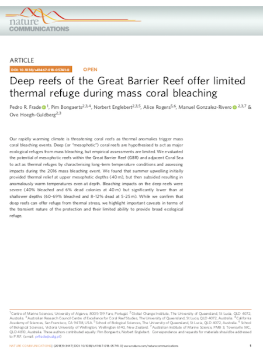
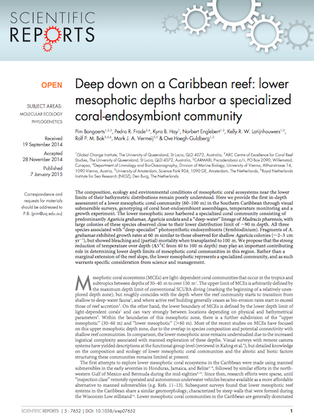

# Monitoring data: shallow to mesophotic

Repository for published shallow/mesophotic longitudinal monitoring datasets: temperature and benthic community data. If you are interested in using any of these data in a study, please cite the corresponding publications and/or the url of this repository (https://github.com/pimbongaerts/monitoring). A short email describing the intended use is always appreciated (pbongaerts@calacademy.org).

*Funding acknowledgements:* (in alphabetical order) Australian Research Council, California Academy of Sciences, Global Change Institute, Hope for Reefs Initiative, Joy Foundation, The Explorers Club, Waitt Foundation, XL Catlin Group

## Benthic datasets by publication

|  | Reference                                                    | Dataset                                                      |
| ------ | ------------------------------------------------------------ | ------------------------------------------------------------ |
| | Hernandez-Agreda A, Sahit FM, Englebert N, Hoegh-Guldberg O, Bongaerts P (2022) Hidden in the deep: Distinct benthic trajectories call for monitoring of mesophotic reefs. *in press* | [benthic csv](https://github.com/pimbongaerts/monitoring/blob/master/temperature/2022_conslett.csv) |
|  | Frade PR, Bongaerts P, Englebert N, Rogers A, Gonzalez-Rivero M and Hoegh-Guldberg O (2018) [Deep reefs of the Great Barrier Reef offer limited thermal refuge during mass coral bleaching](https://dx.doi.org/10.1038/s41467-018-05741-0).  *Nature Communications* 9:3447 | TBD |
|  | Bongaerts P, Frade PR, Hay KB, Englebert N, Latijnhouwers KRW, Bak RPM, Vermeij MJA, Hoegh-Guldberg O (2015) [Deep down on a Caribbean reef: lower mesophotic depths harbor a specialized coral-endosymbiont community]( https://doi.org/10.1038/srep07652). *Scientific Reports* (2015) 5:7652 | TBD                                              |

## Temperature datasets by location

| Region | Location                | Coords               | Period                                                       | Depths (m)*                  | Dataset |
| ------ | ----------------------- | -------------------- | ------------------------------------------------------------ | ---------------------------- | ---------------------------- |
|  | **Great Barrier Reef** |  |  |  |  |
| GBR    | Great Detached*         | S11.70450 E144.06817 | 2012-2017| 10, 40 (,60, 80,100)**       |[csv](https://github.com/pimbongaerts/monitoring/blob/master/temperature/gbr_grdet.csv) |
| GBR    | Tijou*                  | S13.06435 E143.95081 | 2012-2017| 10, 40 (,60, 80,100)**       |[csv](https://github.com/pimbongaerts/monitoring/blob/master/temperature/gbr_tijou.csv) |
| GBR    | Yonge                  | S14.61609 E145.63702 | 2012-2017| 10, 40 (,60, 80,100)**       |[csv](https://github.com/pimbongaerts/monitoring/blob/master/temperature/gbr_yonge.csv) |
|  | **Western Coral Sea** |  | |  | |
| WCS    | Osprey "Dutch Towers"*  | S13.82032 E146.56122 | 2012-2017|10, 40, 60***| [csv](https://github.com/pimbongaerts/monitoring/blob/master/temperature/wcs_ospdt.csv) |
| WCS    | Osprey "Bigeye Ledge"*  | S13.85845 E146.56195 | 2012-2017| 10, 40, 60*** | [csv](https://github.com/pimbongaerts/monitoring/blob/master/temperature/wcs_ospbl.csv) |
| WCS    | Osprey "Nautilus Wall"* | S13.88925 E146.55503 | 2012-2017|10, 40, 60***| [csv](https://github.com/pimbongaerts/monitoring/blob/master/temperature/wcs_ospnw.csv) |
| WCS    | Bougainville 1*         |                      | (2017-)                                                      | 10, 40                       | |
| WCS    | Bougainville 2*         |                      | (2017-)                                                      | 10, 40                       | |
| WCS    | Holmes Reef             | S16.48211 E147.87111 | 2012-2017| 10, 40 (,60)                 |[csv](https://github.com/pimbongaerts/monitoring/blob/master/temperature/wcs_holme.csv) |
|  | **Curacao** (Caribbean) |  | |  | |
| CUR | Director's Bay* |  | 2020-2022 | 5, 10, 20, 40, 60 | TBD |
| CUR | Seaquarium / Substation* | N12.08445 W68.89833 | 2013-2014, 2018-2022 | 10, 25, 40, 60, 80, 100, 120 | TBD |
| CUR | Water Factory* |  | 2020-2022 | 5, 10, 20, 40, 60 | TBD |
| CUR | Snakebay* |  | 2020-2022 | 5, 10, 20, 40, 60 | TBD |
| CUR | Coral Estate* |  | 2020-2022 | 5, 10, 20, 40, 60 | TBD |
| CUR | Playa Hulu* |  | 2020-2022 | 5, 10, 20, 40, 60 | TBD |
| CUR | Playa Kalki* |  | 2020-2022 | 5, 10, 20, 40, 60 | TBD |

\* Temperature loggers still out at these locations

\** Temperatures from depths in brackets were only recorded for a subset of the indicated time period

\*** Temperature loggers from 80 and 100m not yet recovered (contact us for detailed location descriptions)
